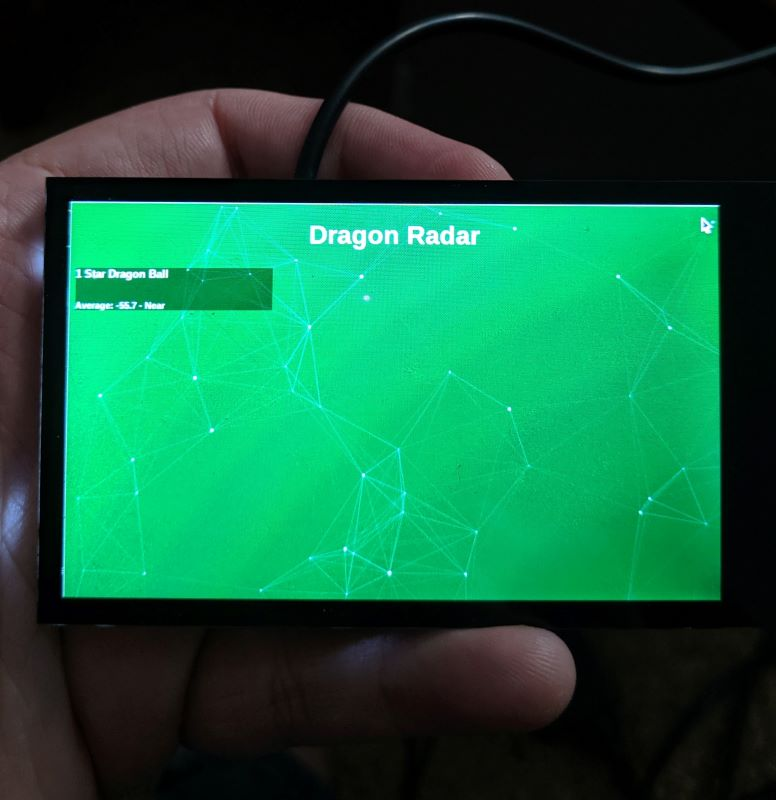

# DragonballRadar-BLE-Beacon
A real life Dragonball Radar using a raspberry PI and BLE locating beacons

Using a [Pi Zero W](https://www.adafruit.com/product/3410), a [Pimorono 4" display from Adafruit](https://www.adafruit.com/product/3578) , and some [Bluetooth BLE Beacons from Gimbal](https://store.gimbal.com/collections/beacons/products/s10), I sent my brother-in-law on a multi-year wild goose chase to collect all 7 dragon balls.  The backend code is a simple Node.js API endpoint that returns recent Bluetooth beacons that match the pattern/settings used for the dragonball beacons.  The frontend code is a simple React app that reads the API and outputs it to the screen (with some added dragonball radar style). 

